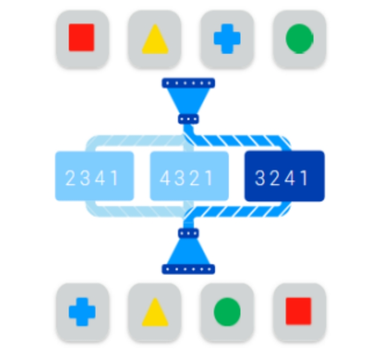
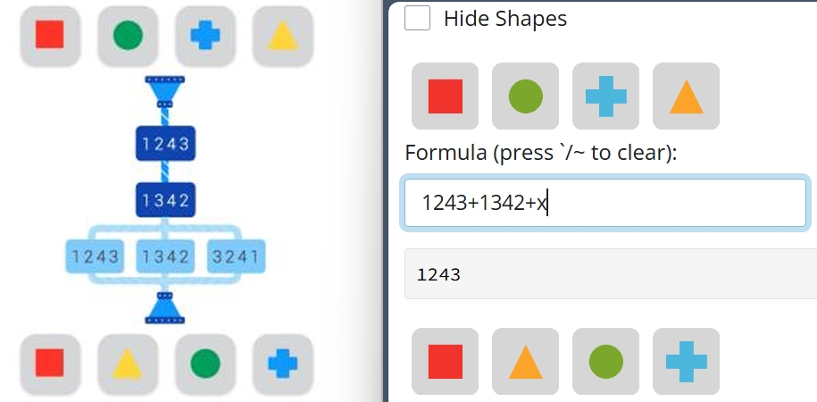
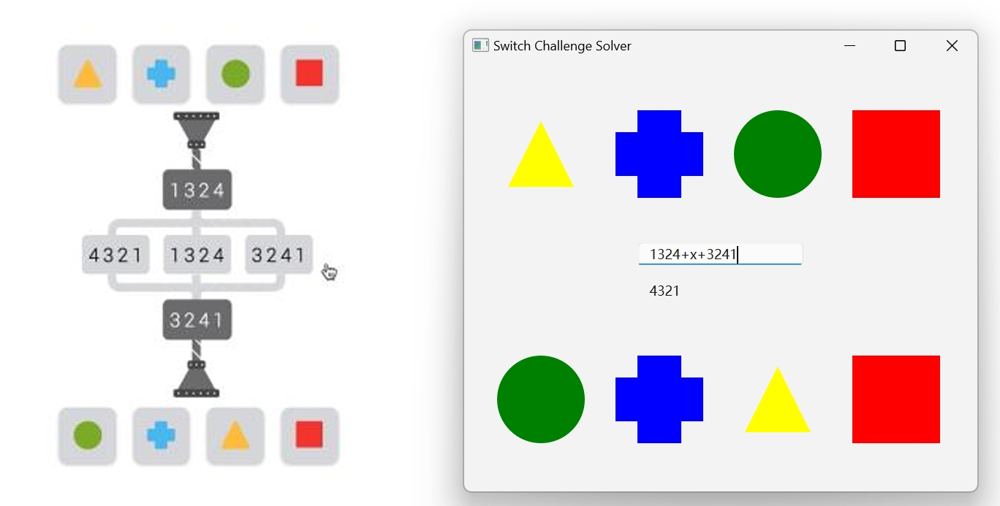
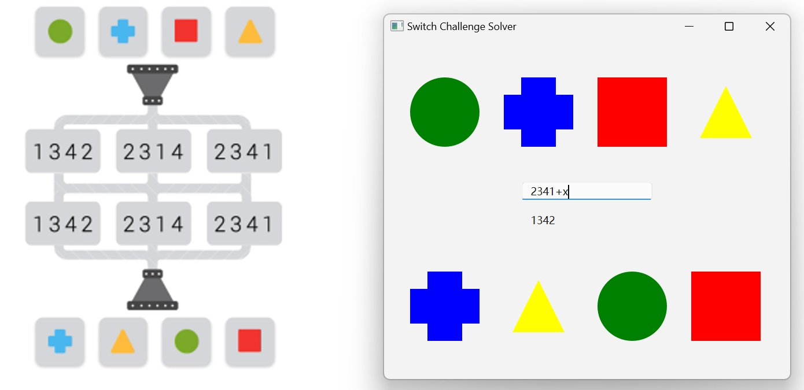
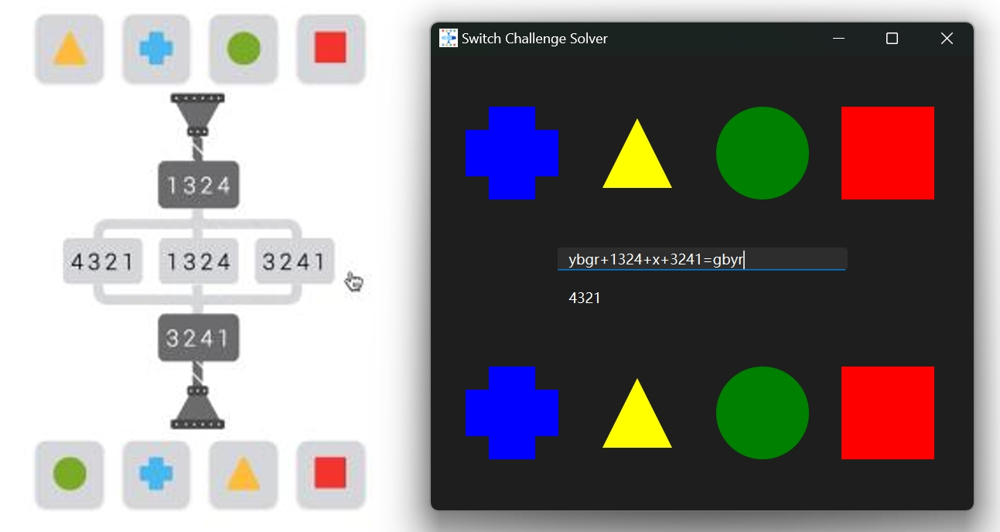
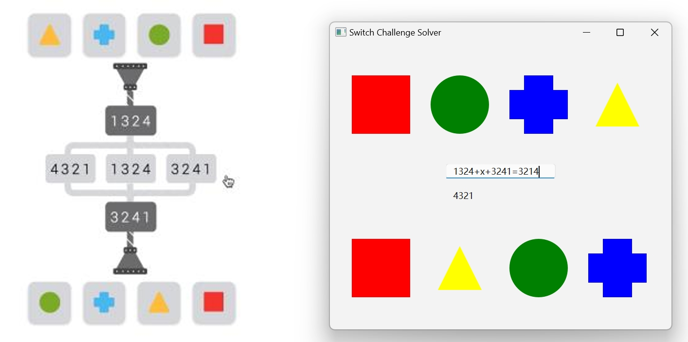
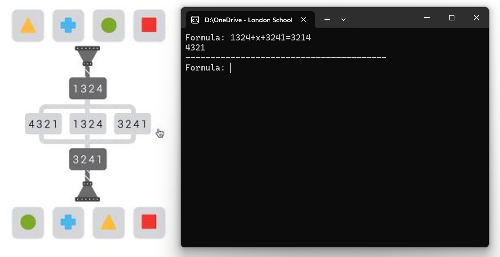
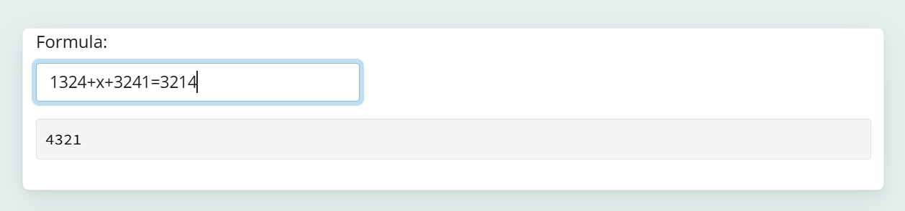

# Access the Switch Challenge Solver

The Switch Challenge Solver can be accessed from my [website page](https://rubuky.com/tool/2024-09-23-SwitchChallenge/) or from [shinyapps.io](https://kv9898.shinyapps.io/switch_challenge/).

# How to Use the Switch Challenge Solver

There are two ways of using the solver:

1.  Drag and Drop to enter the input and outshapes, then enter the middle part of the formula, which is potentially slower.

2.  Enter the full formula, which can be faster when you are more familiar as you have done more assessments (very bad humour).

Please give me a star🌟 if you find this useful.

# Using Drag and Click through GUI

Similar to the problems, there are two rows of "shapes", the row at the top is the inputs while the other one at the bottom is the outputs. By dragging and dropping the shapes, you can enter the input and output colours.

For the easiest problems (as the one below), once you have moved both rows of shapes, the answer is automatically displayed below the line edit:

*PS: to clear the formula and answer, hit the `` ~/` `` button*

For the harder question, you may need to enter the formula (from level 4 onward?) and hit `Enter`. In the formula, you need to replace the options with `x`：

The solver can handle x in any position:

For the hardest questions with two choices, you need to make a guess about the first choice, and let the solver find the second choice. If the answer is not correct, you need to try again. You may need to try 3 times at most:

In this case, the third option of the first choice is the correct answer. This implies that you need to try 3 times if you do from left to right.

# Using the full formula

There are two ways of using the full formula, long form and short form. In both cases, ignore the shapes in the solver, they don't do anything. Both forms work for the GUI, command line and [web app](https://rubuky.com/tool/2024-09-23-SwitchChallenge/).

In the long form, you enter the input and output colors.

Let's use the hard case as an example, the formula would be:

`ybgr+1324+x+3241=gbyr`

The gist of the short formula form is that you encode the outcome (number after `=`) in such a way that it is a single switch from the input to the output. Note that you cannot use the short formula for the easiest problems (you solve it with your brain).

Let's use the hard case as an example:

As the shapes are now redundant, you may want to use the command line, which is more light-weight:

You can also access the web app! [Click here](https://rubuky.com/tool/2024-09-23-SwitchChallenge/)

