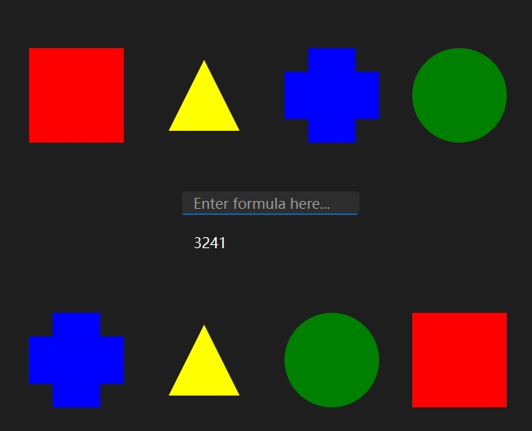

# How to Use the Switch Challenge Solver

There are two ways of using the solver

1.  Drag and Click through the Graphical User Interface (GUI), which is potentially slower, or

2.  Enter the full formula, which can be faster when you are more familiar as you have done more assessments (very bad humour).

# Using Drag and Click through GUI

Similar to the problems, the GUI has two rows of "shapes", the row at the top is the inputs while the other one at the bottom is the outputs. There are two ways of rearranging them:

1.  Dragging: this will *swap* the two shapes.

2.  Clicking: this will move the clicked shape to the *end*. This allows for the order of your 4 clicks to be the final order of the four shapes.

For the easiest problems (as the one below), you just need to hit `enter`，and the answer will be displayed below the line edit:

:::

*PS: to clear the formula and answer, hit `Tab`*

For the harder question, you may need to enter the formula (from level 4 onward?) and hit `Enter`.